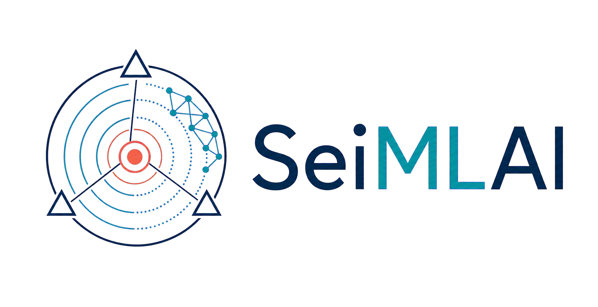

<p align="center">
  
</p>

# SeiMLAI: SEIsmic catalog for Machine Learning And Imaging

**SeiMLAI** is a Python workflow that allows you to obtain a **high-resolution seismic catalog** by leveraging known infrastructure and using new machine-learning algorithms for P- and S-wave picking (Zhu and Beroza, 2019) and phase association (Zhu et al., 2022). After downloading the waveforms for a specific period and area, the waveforms are organised into an archive, and the arrival times of the P- and S-phases are picked. The workflow allows the use of either a pre-trained model, a different deep-learning picker or a user-created model. Once the creation of an archive containing the continuous waveform recorded by a seismic stations, they are employed to create an initial catalogue that can be viewed for the first time. The workflow also offers **accurate post-processing steps** for raw data from machine learning, providing input files for both absolute and relative locations at the end of the workflow that are run using a Docker container.

The product package includes the existing Seisbench and PyGMT libraries for seismic data analysis using machine learning and for the preliminary visualization of the resulting catalog, respectively.

This repository can be used in two ways:

1. Run the seismic processing workflow from the command line.
2. Import `seimlai/` from Python code when developing new tools, notebooks, or tests.

If you are only using the workflow, start with the command-line section. You do not need to import Python modules manually.

## Quickstart

Create or update the Conda environment, activate it, inspect the CLI, then run the workflow:

```bash
conda env update -f environment.yml
conda activate catalog
python main.py --help
python main.py --config user_configuration/config.yaml
```
After installing the package, the same CLI is available as:

```bash
seismic-workflow --config user_configuration/config.yaml
```

The user-editable settings are in [user_configuration/config.yaml](./user_configuration/config.yaml).

## Main CLI Commands

`main.py` is the main entrypoint. It decides which workflow stages to run.

| Command | What it does |
| --- | --- |
| `python main.py` | Run the full workflow. |
| `python -m seimlai.main` | Run the full workflow through the package module. |
| `seismic-workflow` | Run the installed PyPI-style entrypoint. |
| `python main.py --config user_configuration/config.yaml` | Run the full workflow with an explicit config file. |
| `python main.py continue` | Continue from the HypoEllipse output check, stages `06` to `10`. |
| `python main.py 03` | Run one stage by ID. |
| `python main.py cc-dd` | Run cross-correlation differential-time generation. |
| `python main.py hypodd` | Run the Docker HypoDD relocation stage. |
| `python main.py --from 03` | Run from stage `03` through the end. |
| `python main.py --only 06 07` | Run only the selected stage IDs. |
| `python main.py gamma-analysis` | Run optional GaMMA picking/association analysis. |
| `python main.py plot-catalog` | Run optional catalog plotting. |
| `python main.py threshold-analysis` | Run optional threshold comparison plots. |


## Numbered Workflow Stages

| ID | Command | What it does |
| --- | --- | --- |
| `01` | `download` | Download data. |
| `02` | `data-cleaning` | Data cleaning. |
| `03` | `phase-picking` | Phase picking with the configured deep-learning model available on Seisbench. |
| `04` | `association` | Phase association and raw catalog building with GaMMA. |
| `05` | `absolute-location-prep` | Prepare HypoEllipse input files. |
| `06` | `hypoellipse-check` | Run absolute location with HypoEllipse in Docker. |
| `07` | `locations-filtering` | Parse and filter HypoEllipse locations. |
| `08` | `relative-relocation` | Generate HypoDD catalog and station input files. |
| `09` | `cc-dd` | Generate cross-correlation differential times in `dt.cc`. |
| `10` | `hypodd` | Run `ph2dt` and `hypoDD` in Docker. |

## Single Stage Commands

The easiest way to run one stage is through `main.py`:

```bash
python main.py 03
```
The same stages can also be run by command name, for example `python main.py hypodd`.

Stage commands and optional commands are available through `main.py`:

```bash
python main.py plot-catalog
python main.py threshold-analysis
```

## HypoDD Docker Image

The HypoDD stage compiles `ph2dt` and `hypoDD` automatically from the official
`V2.1b` source. The value under `hypodd.docker_image` is used as the prefix for
content-addressed local image tags; it is not necessary to build the image by
hand.

The compilation uses the editable templates in `user_configuration/hypodd/`.
Effective copies are written to the case-specific
`hypodd/input&output` directory, so a run never modifies the templates tracked
by Git.

Array dimensions are selected under `hypodd.dimensions` in `user_configuration/config.yaml`:

```yaml
hypodd:
  dimensions:
    mode: auto
    maxeve0: 2
    maxlay: 50
    maxcl: 200
```

In `auto` mode, event, station, phase, and observation dimensions are calculated
from the input and generated files with 10% headroom. `MAXEVE0`, `MAXLAY`, and
`MAXCL` come from `user_configuration/config.yaml`. In `manual` mode, edit the `MANUAL` blocks in
both templates; the workflow activates those blocks and rejects statically
undersized values before compilation.

Compilation runs in two phases: `ph2dt` is built and run first, then `dt.ct` is
counted before `hypoDD` is built. Images are reused when the source version and
rendered include content have already been compiled. Runtime files are retained
in `hypodd/input&output`, while logs and final relocation files are written to
`hypodd/output`.

## Catalog Output Layout

Each catalog stores downloaded data in `archive/` and workflow results in
`output/`. A run is identified by both picking thresholds, for example
`output/threshold_p0.8_s0.8/`.

```text
archive/
  inventory/  waveforms/  stations.csv  download_log.txt
output/
  threshold_comparison/
  threshold_p<P>_s<S>/
    output_picks_<P>/
    output_catalog_<P>/
      gamma/  hypoellipse/{input,output}/  hypodd/{input,input&output,output}/
```

`threshold_comparison/` contains reports that aggregate multiple threshold
runs. HypoEllipse input and final files are separated in `input/` and `output/`.
HypoDD uses `input&output/` for the `ph2dt` products consumed by `hypoDD`.

## Repository Layout

| Path | Purpose |
| --- | --- |
| `main.py` | Compatibility wrapper for the package CLI. |
| `user_configuration/config.yaml` | User settings only. No calculations happen here. |
| `environment.yml` | Conda environment definition. |
| `user_configuration/` | Editable HypoEllipse models/configuration and HypoDD templates/Dockerfile. |
| `seimlai/` | Importable workflow implementation. |
| `tests/` | Smoke tests for runtime context and derived settings. |

## Using The Python Library

The `seimlai/` package exists so Python code can reuse workflow stages without copying script logic.

Run a single stage from Python:

```python
from seimlai.context import build_context
from seimlai.phase_picking import run_phase_picking

ctx = build_context("user_configuration/config.yaml")
run_phase_picking(ctx)
```

Run another stage:

```python
from seimlai.context import build_context
from seimlai.association import run_association

ctx = build_context("user_configuration/config.yaml")
run_association(ctx)
```

This is useful for notebooks, tests, new scripts, or a future interface around the same processing code.

## Inside `seimlai/`

| Module | Purpose |
| --- | --- |
| `main.py` | Main CLI orchestrator for the whole workflow. |
| `context.py` | Loads `user_configuration/config.yaml`, validates settings, builds derived paths/settings, and lazily creates heavy objects such as models, devices, transformers, and FDSN clients. |
| `download.py` | Implementation for waveform/station download. |
| `data_cleaning.py` | Implementation for the cleaning stage. |
| `phase_picking.py` | Implementation for deep-learning models to phase picking. |
| `association.py` | Implementation for GaMMA association and raw catalog generation. |
| `absolute_location_prep.py` | Implementation for HypoEllipse/Hypo71 preparation files. |
| `hypoellipse_check.py` | Runs HypoEllipse with Docker using generated input files. |
| `location_filtering.py` | Parses HypoEllipse output and filters location results. |
| `relative_relocation.py` | Generates HypoDD input files. |
| `cc_dd.py` | Pipeline entrypoint for cross-correlation differential-time generation. |
| `hypodd.py` | Runs `ph2dt` and `hypoDD` through Docker. |
| `analysis.py` | Optional GaMMA result analysis. |
| `plotting.py` | Optional catalog plotting. |
| `threshold_analysis.py` | Optional threshold comparison analysis. |

## Understanding `user_configuration/config.yaml`

`user_configuration/config.yaml` contains explicit user settings only. It should not calculate paths, create folders, connect to services, or load models. Those runtime values are built by `seimlai.context`.

| Section | Controls |
| --- | --- |
| `case_study` | Case name, optional external output folder, and whether to run downloads. |
| `geography` | Latitude/longitude bounds for download and association. |
| `dates` | Start/end date and year. |
| `stations` | Network, channel, station filters, and FDSN providers. |
| `model` | Neural-network choice, pretrained/custom model options, batch size, and pick thresholds. |
| `phase_picking` | Runtime controls for `phase_picking.py`, such as worker counts. |
| `gamma` | GaMMA association bounds, velocity settings, DBSCAN, eikonal, and filtering parameters. |
| `analysis` | Analysis log filename. |
| `plotting` | GMT/PyGMT plotting settings. |
| `hypoellipse` | Minimum P/S picks for HypoEllipse preparation, plus velocity model and parameter file paths. |
| `hypoellipse_check` | Docker image and startup timeout for `hypoellipse_check.py`. |
| `dd` | Filters for differential relocation input generation. |
| `hypodd` | Docker image prefix, automatic/manual array dimensions, `ph2dt` parameters, relocation controls, and the 1D velocity model. |
| `cc_dd` | Cross-correlation settings for `cc_dd.py`, including workers, channels, and CC thresholds. |
| `threshold_analysis` | Threshold map and plotting DPI for `threshold_analysis.py`. |

## Mental Model

- `python main.py` runs the full workflow controller.
- `python main.py 03` runs one stage by ID.
- `python -m seimlai.main` runs the same controller through the package.
- `python main.py cc-dd` and `python main.py hypodd` run stages `09` and `10` by command name.
- `python main.py plot-catalog` runs an optional command through the main controller.
- `import seimlai.phase_picking` reuses the implementation from Python code.

Most users only need `main.py` and `user_configuration/config.yaml`.

## Software and references

SeiMLAI builds on the following open-source software and methods. Please cite
the relevant publications when using this workflow.

## References

SeiMLAI relies on the following open-source software and methods. Please cite
the relevant publications when using this workflow.

- **SeisBench** — Woollam, J., Münchmeyer, J., Tilmann, F., et al. (2022).
  *SeisBench—A toolbox for machine learning in seismology*. Seismological
  Research Letters, 93(3), 1695–1709.
  [https://doi.org/10.1785/0220210324](https://doi.org/10.1785/0220210324)

- **PyGMT** — Tian, D., Fröhlich, Y., Leong, W. J., et al. (2026).
  *PyGMT: Bridging Python and the Generic Mapping Tools for geospatial
  visualization and analysis*. Geochemistry, Geophysics, Geosystems, 27,
  e2026GC013105.
  [https://doi.org/10.1029/2026GC013105](https://doi.org/10.1029/2026GC013105)

- **PhaseNet** — Zhu, W., & Beroza, G. C. (2019). *PhaseNet: A
  deep-neural-network-based seismic arrival-time picking method*.
  Geophysical Journal International, 216(1), 261–273.
  [https://doi.org/10.1093/gji/ggy423](https://doi.org/10.1093/gji/ggy423)

- **GaMMA** — Zhu, W., McBrearty, I. W., Mousavi, S. M., Ellsworth, W. L.,
  & Beroza, G. C. (2022). *Earthquake phase association using a Bayesian
  Gaussian Mixture Model*. Journal of Geophysical Research: Solid Earth, 127,
  e2021JB023249.
  [https://doi.org/10.1029/2021JB023249](https://doi.org/10.1029/2021JB023249)

- **EQTransformer** — Mousavi, S. M., Ellsworth, W. L., Zhu, W., Chuang,
  L. Y., & Beroza, G. C. (2020). *Earthquake transformer—An attentive
  deep-learning model for simultaneous earthquake detection and phase
  picking*. Nature Communications, 11, 3952.
  [https://doi.org/10.1038/s41467-020-17591-w](https://doi.org/10.1038/s41467-020-17591-w)

- **HYPOELLIPSE** — Lahr, J. C. (1989). *HYPOELLIPSE/version 2.0: A computer
  program for determining local earthquake hypocentral parameters, magnitude,
  and first-motion pattern*. U.S. Geological Survey Open-File Report 89-116.
  [https://doi.org/10.3133/ofr89116](https://doi.org/10.3133/ofr89116).
  Software implementation: [INGV/hypoellipse](https://github.com/INGV/hypoellipse).

- **Docker** — Merkel, D. (2014). *Docker: Lightweight Linux containers for
  consistent development and deployment*. Linux Journal, 239, 2.

- **hypoDD** — Waldhauser, F., & Ellsworth, W. L. (2000). *A double-difference
  earthquake location algorithm: Method and application to the Northern Hayward
  Fault, California*. Bulletin of the Seismological Society of America, 90(6),
  1353–1368.
  [https://doi.org/10.1785/0120000006](https://doi.org/10.1785/0120000006)

  Waldhauser, F. (2001). *hypoDD—A program to compute double-difference
  hypocenter locations*. U.S. Geological Survey Open-File Report 01-113.
  [Software repository](https://github.com/fwaldhauser/HypoDD).

## Citation

If you use **SeiMLAI** in your research, please cite:

> Fonzetti R., Crocetta A., and Bailo D., (year)
> Istituto Nazionale di Geofisica e Vulanologia (INGV), Rome, Italy
> *SeiMLAI: SEIsmic catalog for Machine Learning And Imaging*. **Nome della rivista**, volume(numero), pagine.  
> https://doi.org/xxxxx

## License

© 2027 EPOS — European Plate Observing System.

This work is licensed under the [Creative Commons Attribution 4.0 International License](https://creativecommons.org/licenses/by/4.0/), unless otherwise stated.

Individual software packages, data services, waveform data, station metadata and external images remain subject to their respective licenses and terms of use.

## Contact

**Corresponding author:** [Rossella Fonzetti]  
[Istituto Nazionale di Geofisica e Vulanologia (INGV), Rome, Italy]  
[Email](mailto:rossella.fonzetti@ingv.it)

For questions, bug reports, or collaborations related to SeiMLAI, please contact
the corresponding author.
